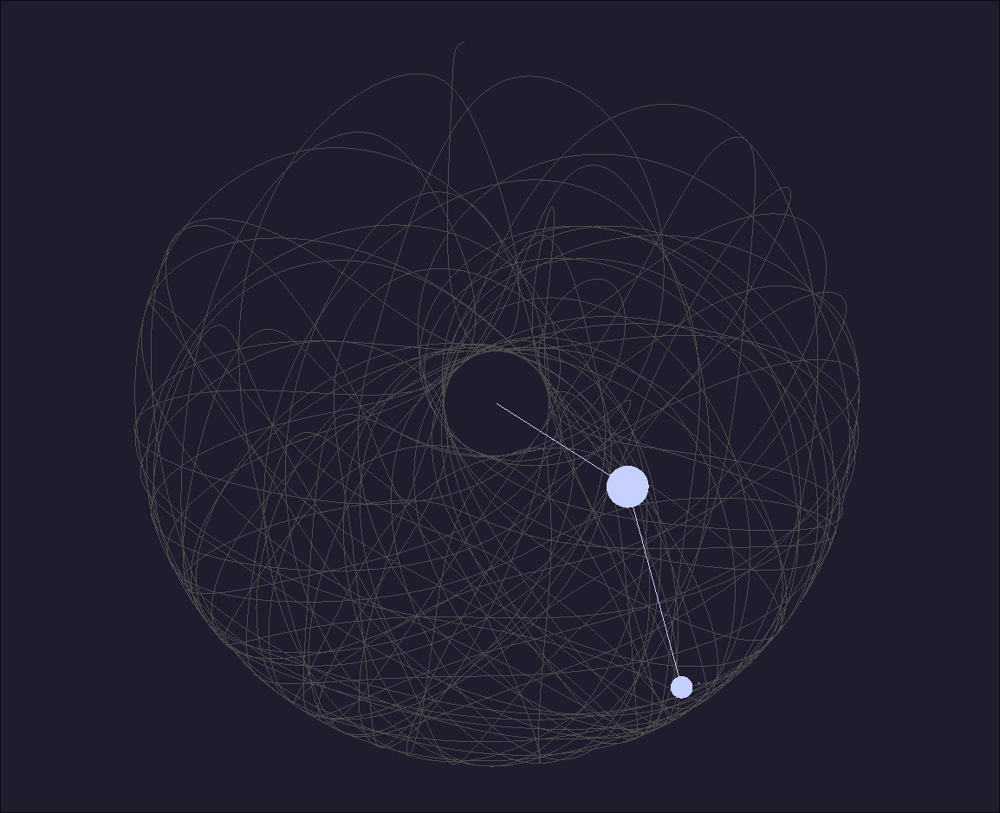
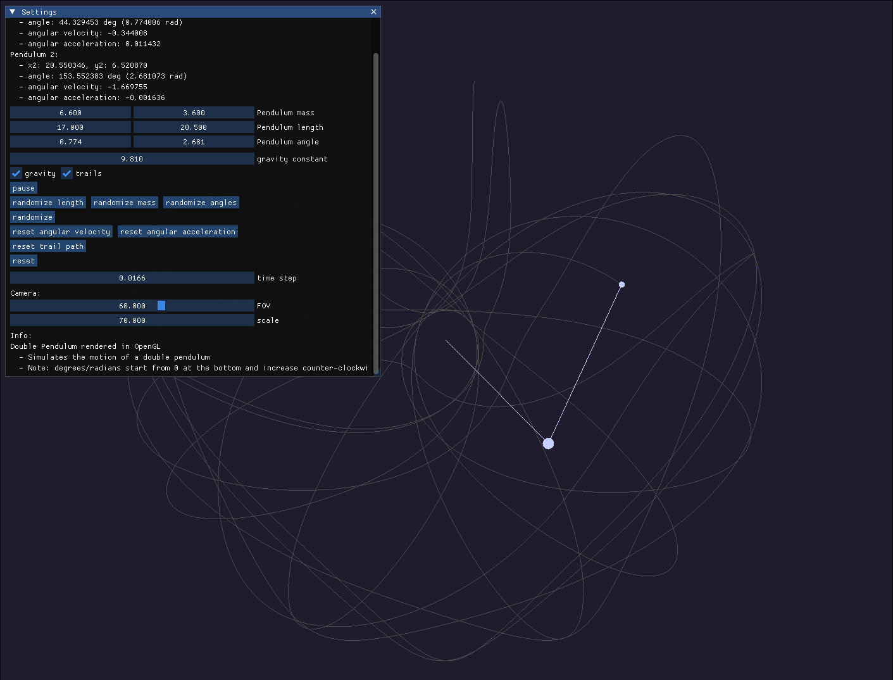

# Double Pendulum
A small program that renders and simulates a double pendulum in C++ and OpenGL



# Building
Copy and clone the git url

Inside the directory create the build using cmake
```
mkdir build
cd build
cmake ..
```
Build using ```make``` on linux

Use ```cmake --build .``` on Windows

# Edit with ImGui
Press the 'c' key to open the settings window.
You can pause, toggle trail paths, and change the masses and lengths of each of the pendulums.


